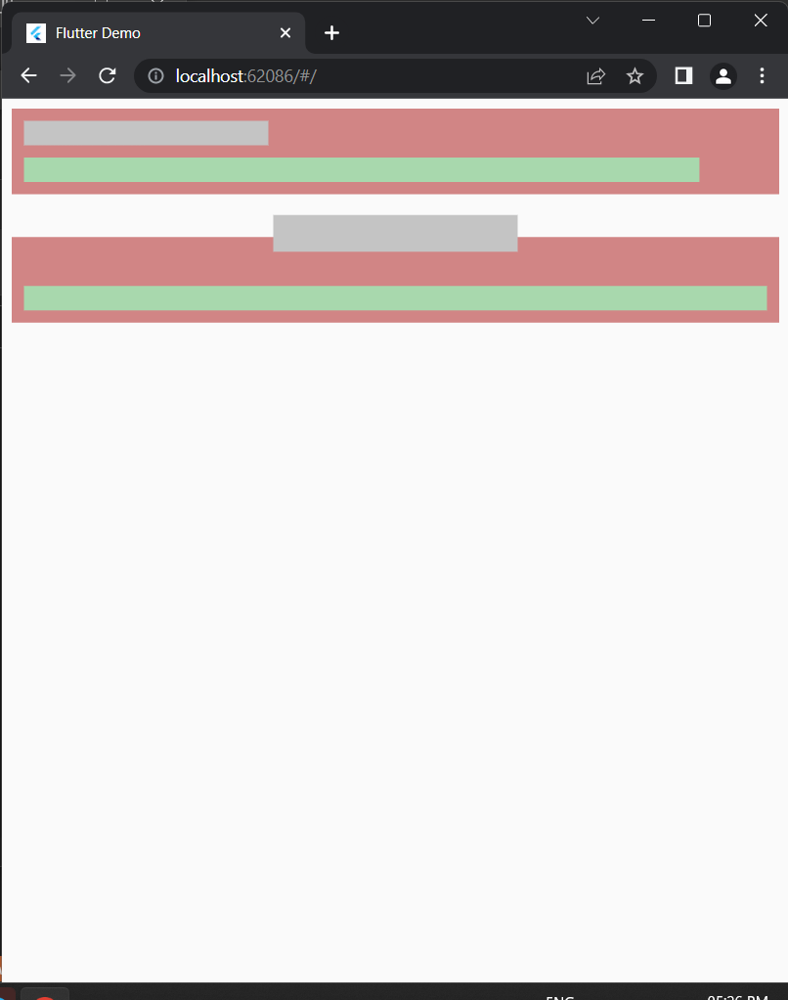
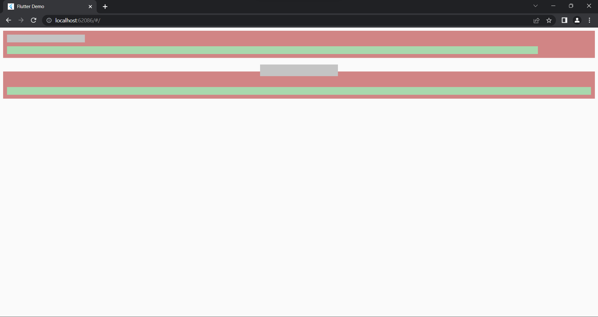

# Aimed Internship Assignment

This is aimed internship assignment which is recreation of following design <a href="https://www.figma.com/file/3laNo8t40YceonUnslUNRA/figma%2Fwhiteboard?node-id=0%3A1">https://www.figma.com/file/3laNo8t40YceonUnslUNRA/figma%2Fwhiteboard?node-id=0%3A1</a>.

## Result

The Design is made responsive <b>without the use of MediaQuery.</b>

<table>
<tr>
<td> 
Ipad screen

</td>
<td> 
Desktop screen

</td>
</tr>
</table>

## Setup

### Clone the Project

```bash
    git clone https://github.com/bhagwanZaki/Aimed-Internship-assignment.git
```

### Get the packages

```dart
    flutter pub get
```

### Run the app

```dart
    flutter run
```
